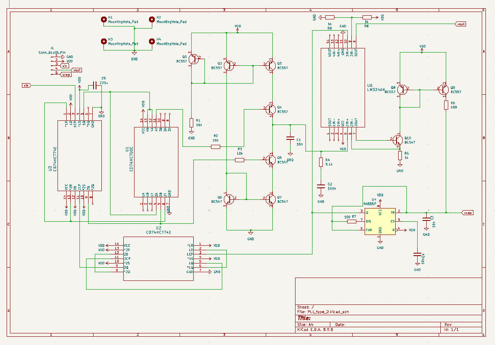
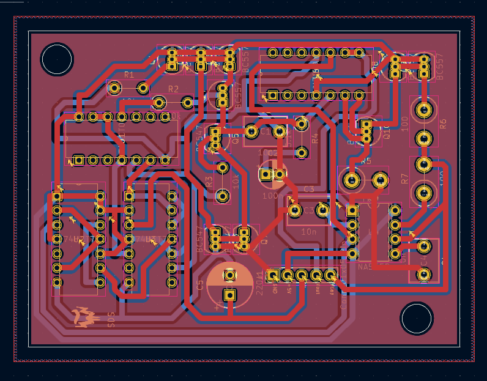
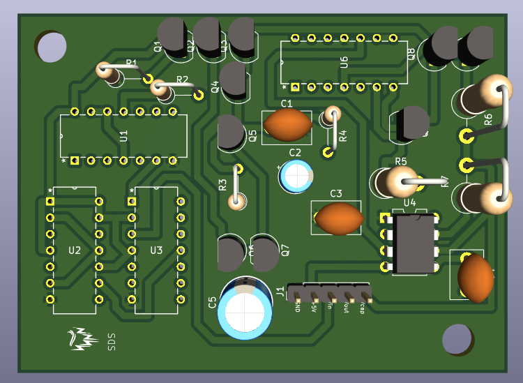

# 🚀 Phase Locked loop 
This project is  done in order to understanding the working and designing of Phase locked Loops, that forms basics for most of electronic circuits.   

---

## 📸 Software Screenshots
- Schematics   

- 2 layer fill view of PCB   

- 3D view of PCB   

---
## 📸 Hardware Views
- Fabricated PCB   

- Final Product   

---

## 🎥 Working Video

---

## ✨ Features

- Primary loop that fine tunes and locks freuency at specified frequency (doubles).
- Integrated frequency loop acts as coarse tuning and frequency stabilizing.
- Working range of input: 5kHz - 25kHz.
- 100% duty cycle of output.

---

## 🧰 Technologies/Softwares Used

- **LTSpice**
- **KiCAD**

---

## 👨‍💻 Teammates

| Name                                                  | Course                                          |
|-------------------------------------------------------|-------------------------------------------------|
| [Shrinivas B M](https://github.com/Air-36)            | B.tech, Electronics & Communication Engineering |
| [S. Sirichandana](https://github.com/sirichandana138) | B.tech, Electical Engineering                   |
| Darshini kinni                                        | B.tech, Mechanical Engineering                  |

## 👨‍🏫Supervision
This project was completed under the guidance of:

[Dr. Nijwm Wary](https://nijwmwary.com/)  
School of Electrical and computer sciences,  
Indian Institute of technology,    
Bhubaneshwar

